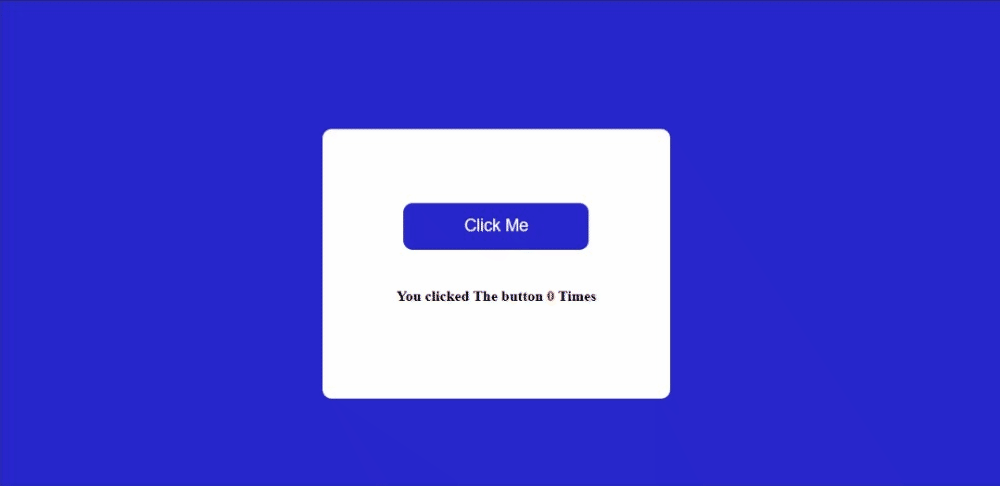
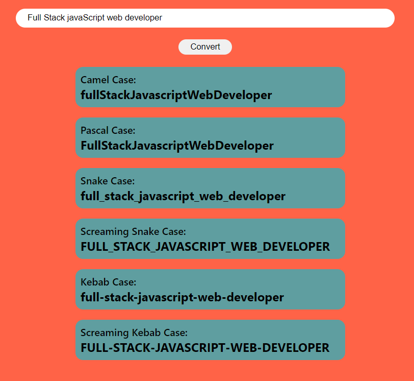

# Technology used 

## Project name: Click The Button

Created simple project which incraese the counter evry time we click on the button.

### Key learnings

- DOM Manipulation.

### Output

## Project name: Name conversion

This project will convert text to diffrent case.

### Key learnings

- DOM Manipulation
- String methods

### Output

## Project name: Color changer

This project will change background color of canvas when we click the button.

### Key learnings

- DOM Manipulation
- Math function

### Output

