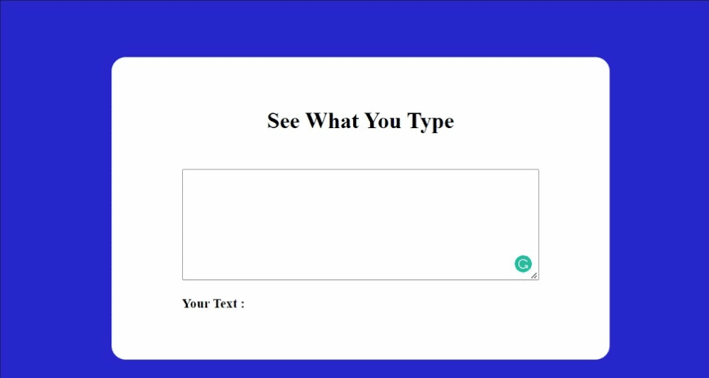
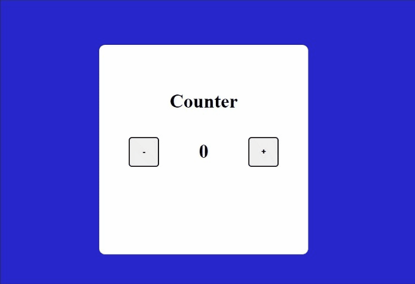

# Technology used 

## Project name: Click The Button

Created simple project which incraese the counter evry time we click on the button.

### Key learnings

- DOM Manipulation.

### Output:

## Project name: Name conversion

This project will convert text to diffrent case.

### Key learnings

- DOM Manipulation
- String methods

### Output:

## Project name: Color changer

This project will change background color of canvas when we click the button.

### Key learnings

- DOM Manipulation
- Math function

### Output:

## Project name: See What you type

This project will write the text which you write in the input.
### Key learnings

- DOM Manipulation

### Output:

## Project name: Basic counter

This basic project will increase or decrease count based on button clicked.

### Key learnings

- DOM Manipulation

### Output:

## Project name: Jokes genrator API

This project will provide random jokes with the help of API.

### Key learnings

- API
- DOM Manipulation

### Output:

